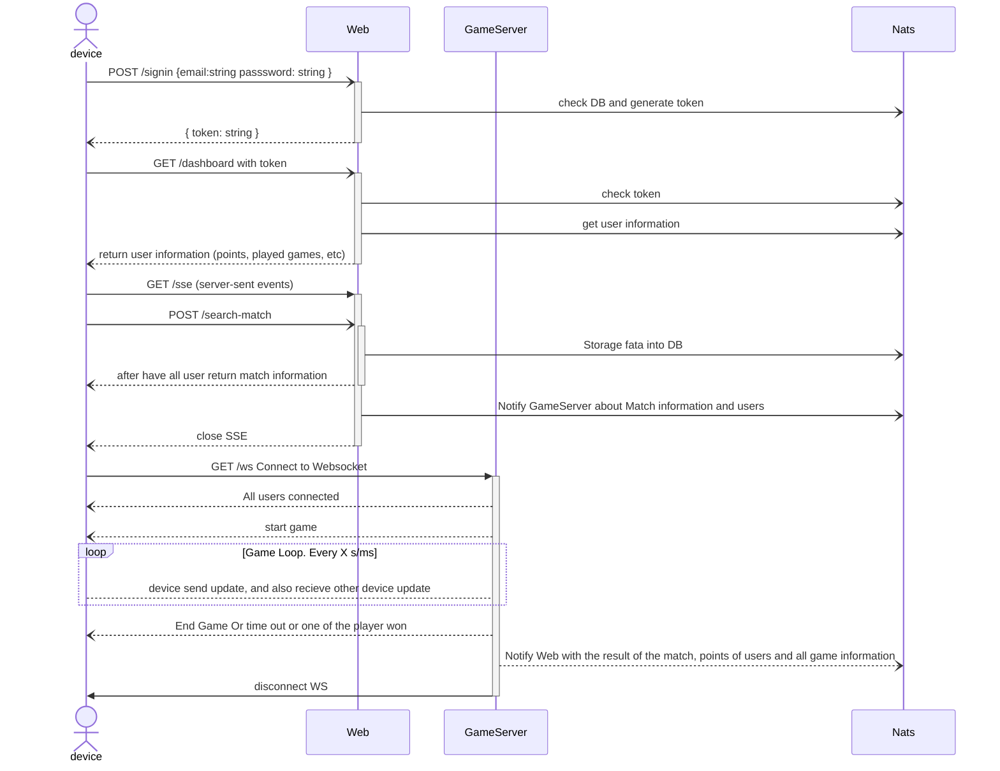

# Web Game Server

## Getting started
WebGameServer requires Go version 1.23 or above.
Libraries:
- Gin: Web framework 
- Gorilla: WebSocket
- Nats: Key/Value storage, PubSub/Queue

### Sequence Diagram



### Projects

- [Web Project](#web-project)


#### Web Project
Web project it's a web server, with some api endpoints, and Server Side Event.

```sh
cd web

go run ./cmd/web.go
```


### TODO:
<style>
r { color: Red }
o { color: Orange }
g { color: Green }
</style>

- working in [Common](./common/)
    - <o>[x] Progress:</o> Common with Server Sent Event Example
    - <o>[ ] TODO:</o> Common with Websocket example
    - <r>[ ] TODO:</r> Common with Nats example (Queue, Pubsub, Key/Value)
    - <r>[ ] TODO:</r> Start with API in Golang
    - <r>[ ] TODO:</r> Start with GameServer in Golang
    - <r>[ ] TODO:</r> Create basic TicTacToe game puse js


