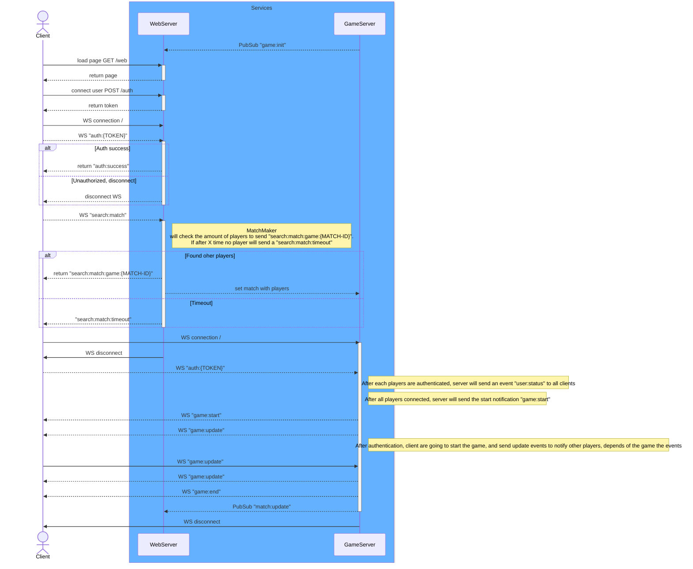

## Web

Basic web app, that will contain a base web alication with websocket + an api.
We're using:
- Typescript (and building with SWC)
- ExpressJS (Web Framework)
- Inversify (Inversion Of Controll)
- Test Jest & SWC
- Biome as Linter

**Scripts:**

```sh
#---------- Install
$ npm install

#---------- Test
# Run Unit tests
$ npm run test

# Run e2e tests
$ npm run test:e2e


#---------- Run
$ npm run dev
```

### Full Sequence Diagram



